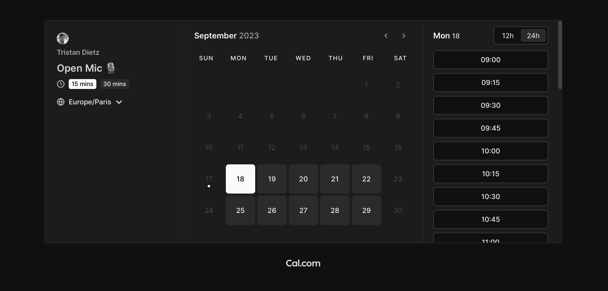
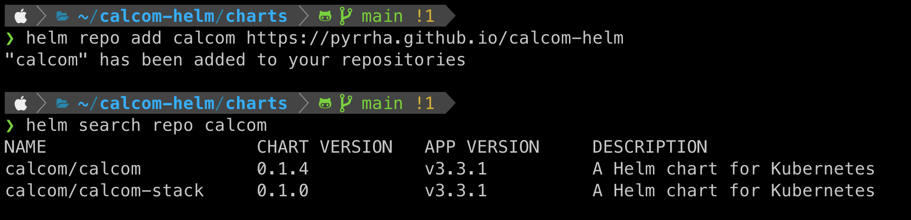

# Calcom Helm

[Cal.com](https://cal.com/fr) is a powerful tool for booking meetings. It offers integrations that allow you to store contact information into a CRM as events booked in your calendar. The user-friendly interface helps your leads and customers easily connect with you.



## Purpose

This Helm Chart provides a proposal for deploying Cal.com on a Kubernetes cluster using Helm. It utilizes the [Docker image](https://github.com/calcom/docker) provided by Cal.com.



## Usage

```sh
# Add the Helm repository
helm repo add calcom https://pyrrha.github.io/calcom-helm

# Verify the repository
helm search repo calcom
```

### Using standalone Calcom

To deploy Calcom as a standalone application, simply run:

```
helm upgrade --install --values values.yaml calcom calcom
```

In the `values.yaml` file, you should provide Ingress settings, Ingress class, and some TLS information for proper configuration. For detailed configuration options, please refer to the **Variables** section below.

### Using Calcom Stack

To deploy Calcom along with a PostgreSQL database, run:

```
helm upgrade --install --values values.yaml calcom-stack calcom-stack
```

In the value file, you can also configure Ingress information. Additionally, you can use the PostgreSQL fields to specify the user, password, and database. However, it's important to note that this is not a secure option. The recommended approach is to use another secret for these credentials, following the guidance provided in [postgresql.auth.existingSecret](https://github.com/bitnami/charts/blob/main/bitnami/postgresql/values.yaml).

👉 An [example of a Persistent Volume (PV)](https://github.com/Pyrrha/calcom-helm/blob/main/examples/pv.yaml) is provided to help you quickly get started. This PV will be used by the database to store all the information about the application. Please use it with caution.

## Variables

The variables used in this Chart are based on the latest application [environment file example](https://github.com/calcom/cal.com/blob/main/.env.example). Some variables might be missing or have been newly introduced. We welcome contributions, so feel free to open a pull request to add missing variables.

Since many of these variables contain tokens or password information, they should be stored in a Kubernetes secret. Variables that have already been handled are located in the [deployment file](https://github.com/Pyrrha/calcom-helm/blob/main/charts/calcom/templates/deployment.yaml).

👉 You can find an [example](https://github.com/Pyrrha/calcom-helm/blob/main/examples/secret.yaml) of the minimal required variables in the example directory.

### Mandatory Runtime Variables

> ⚠️ These variables must also be provided at runtime, or the Chart will not function correctly.
> They must be present in the secret referenced as `secretRef` in Calcom's values.

| Variable              | Description                                             |
| --------------------- | ------------------------------------------------------- |
| NEXT_PUBLIC_WEBAPP_URL| The base URL of the site.                               |
| NEXTAUTH_SECRET       | Secret used to encrypt JWTs for NextAuth.              |
| CALENDSO_ENCRYPTION_KEY| Application Key for symmetric encryption and decryption. It must be 32 bytes for AES256 encryption algorithm. |
| DATABASE_URL          | The database URL including credentials.                |

## Contributing

Work in progress. You can open an issue at this time.

## Troubleshooting

### Application Variable Not Working in the Chart

Development of the Chart may not always keep up with changes in the application. If you encounter an issue with a variable, first check if it's present in the [deployment file](https://github.com/Pyrrha/calcom-helm/blob/main/charts/calcom/templates/deployment.yaml). If it's missing, you can either open a pull request or an issue to have it added. Alternatively, you can customize the deployment file in your own configuration if necessary.
